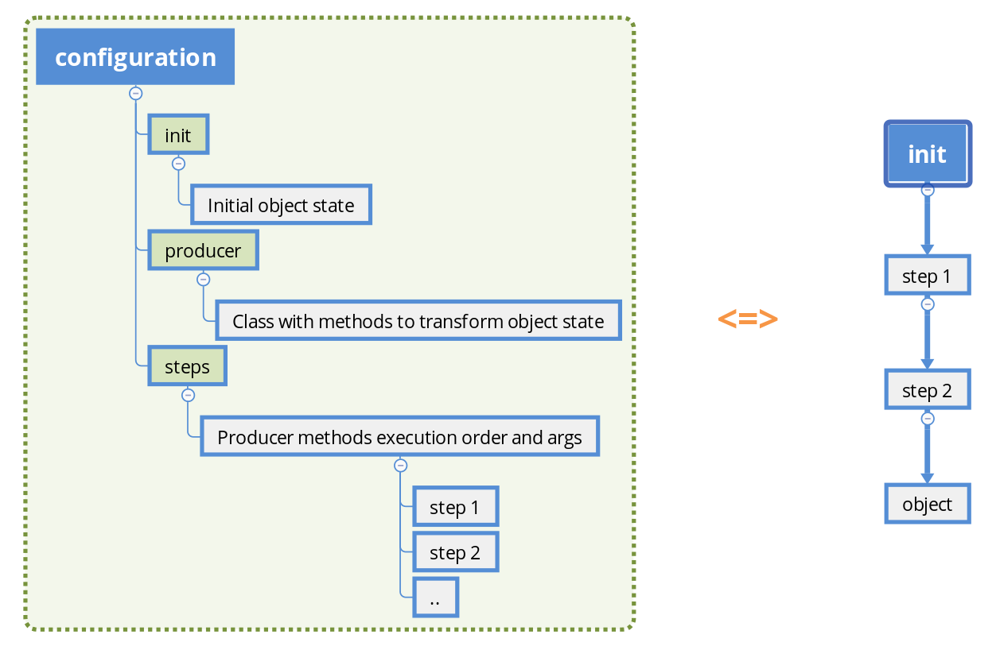

Welcome to Pycnfg's documentation!
===================================

**Pycnfg** is a tool to execute Python-based configuration.

- Pure Python.
- Flexible.

Pycnfg offers unified patten to create arbitrary Python objects pipeline-wise.
That naturally allows to control all parameters via single file.

For more details, please refer to
`Concepts <Concepts.html>`_.

.. toctree::
   :maxdepth: 1
   :caption: Contents:

   Installation <Installation>
   Get started <Get-started>
   Concepts <Concepts>
   Examples <Examples>
   Default configuration <Default-configuration>
   Python API <Python-API>
   Documentation <README>

.. toctree::
   :hidden:

..   Advanced Topics <Advanced-Topics>
   FAQ <FAQ>
   Development Guide <Development-Guide>

Indices and tables
==================

.. .. * :ref:`genindex`
.. .. * :ref:`modindex`
.. .. * :ref:`search`